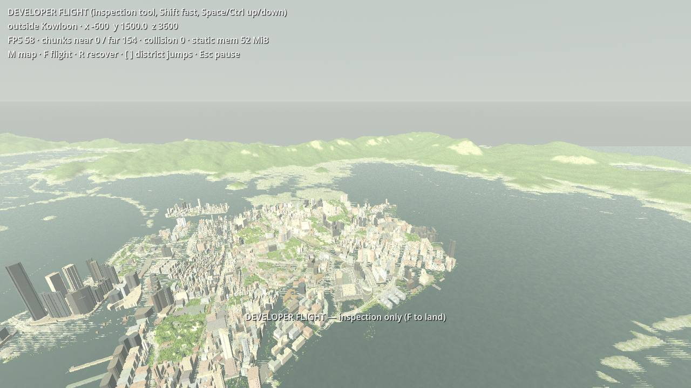
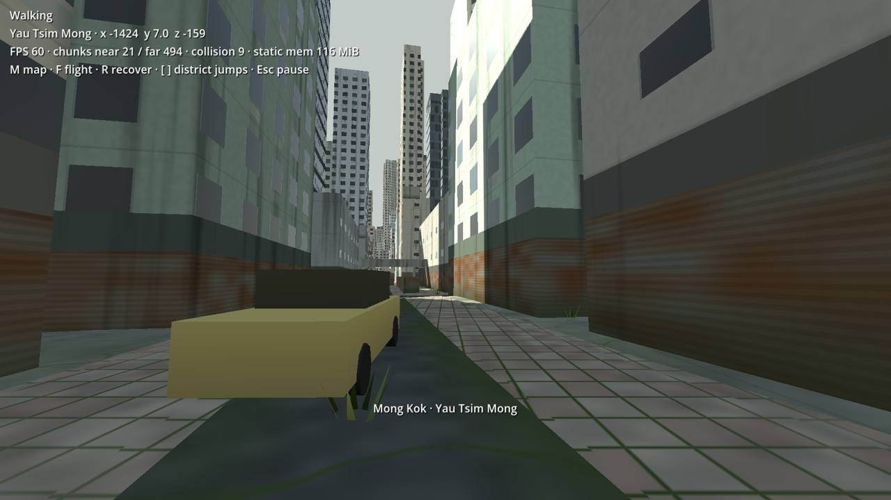
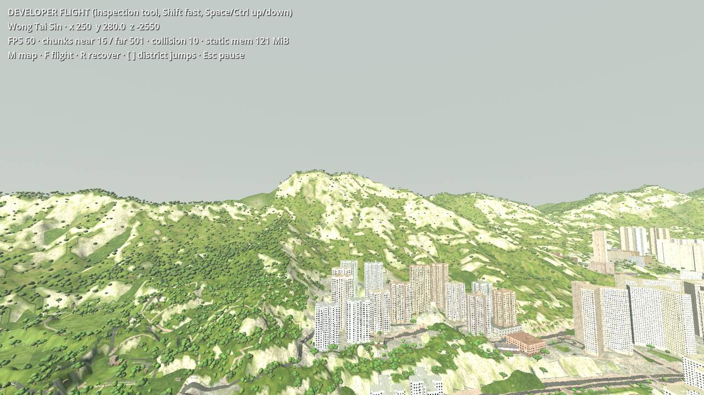
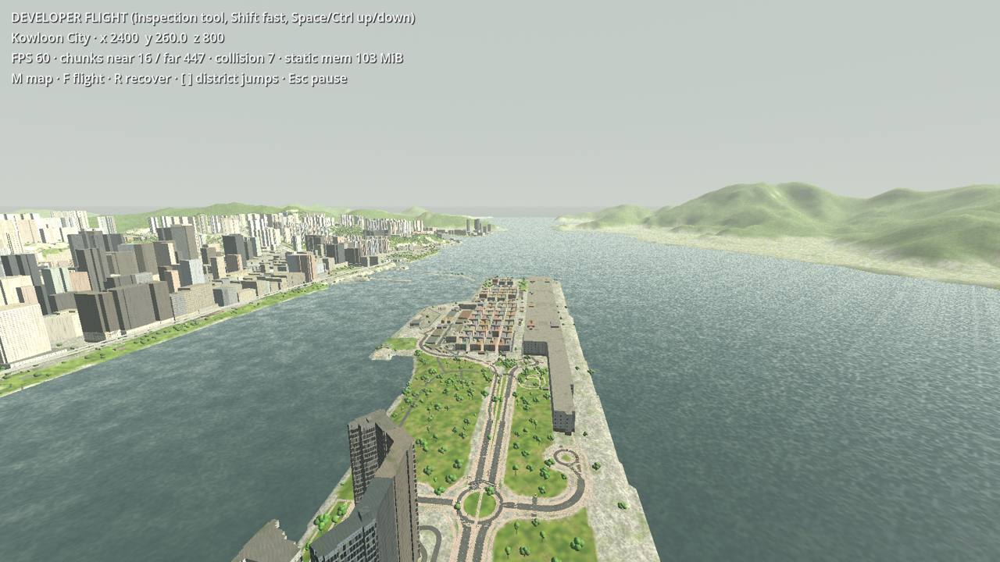
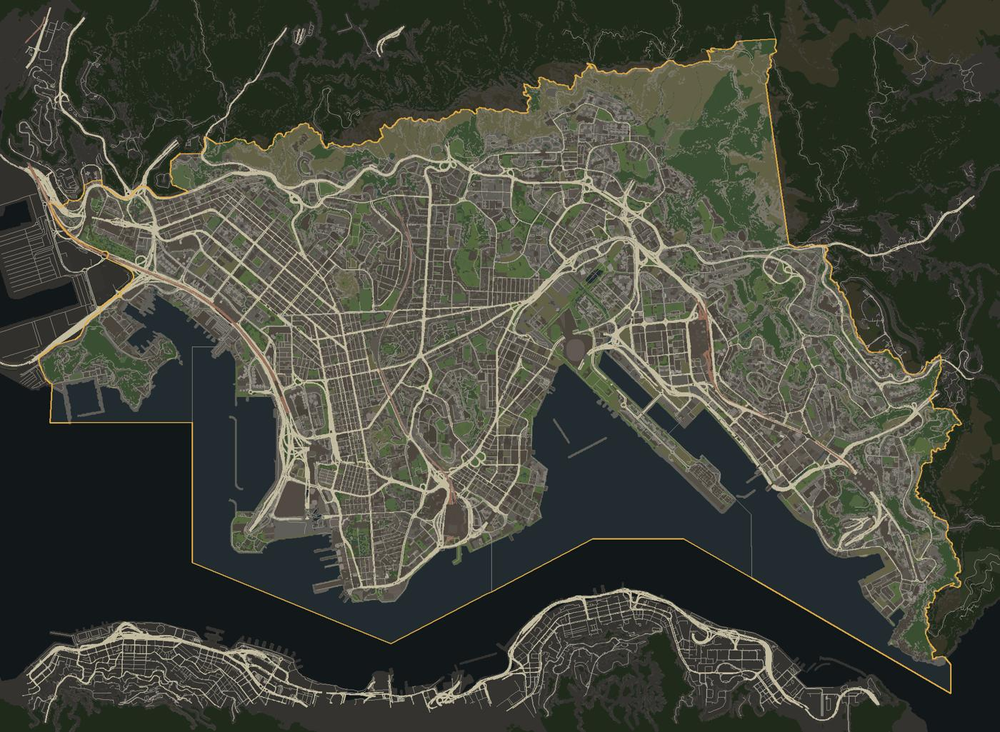

# Kowloon world map pipeline

This document covers how the streamed exploration world is built from real survey data, its limitations, and the commands verified on 4 October 2026. The world is shared by all chapters. Chapters are narrative progression inside it, not geographic limits. The placeholder Chapter 1 scene stays a separate regression scene until its POIs move into the world.

## Coverage decision

The coverage polygon is **Kowloon as the five Kowloon District Council districts**: Yau Tsim Mong, Sham Shui Po, Kowloon City, Wong Tai Sin and Kwun Tong. It is taken from OpenStreetMap relation [10268797](https://www.openstreetmap.org/relation/10268797) (`admin_level=5`, "Kowloon"). This is Kowloon proper **plus New Kowloon** up to the Kowloon ridge (Lion Rock, Beacon Hill, Tate's Cairn, Kowloon Peak), Kai Tak, Lei Yue Mun and Stonecutters Island.

The statutory New Kowloon boundary was not digitised separately. Fragments of New Kowloon administered by Kwai Tsing, Sha Tin or Sai Kung districts are therefore outside the polygon. The district boundaries extend into the harbour, so the polygon covers 59.96 km², of which **47.33 km² is land** (DTM > 0).

Geometry is generated for the polygon plus a 120 m fringe so that edges do not end abruptly. Terrain beyond it, including Hong Kong Island, the Kowloon ridge's north side and Tsuen Wan, is a coarse **background** with no buildings.

## Sources

`assets-source/kowloon/sources.json` is the manifest: URLs, licences, checksums, retrieval dates, bounds and limitations. Raw files live in `assets-source/kowloon/raw/` and are **not committed** (105 MB). `tools/world/fetch.py` re-downloads them and verifies checksums.

| Source | Use | Licence / attribution | Notes |
| --- | --- | --- | --- |
| LandsD 5 m Digital Terrain Model (`Whole_HK_DTM_5m.zip`, 28.7 MB, ASCII grid 2019-03-11) | Ground heights, land/sea mask, bridge-deck heights, background hills | DATA.GOV.HK terms; © Lands Department, HKSAR Government | ±5 m stated accuracy; integer metres; sea = 0. Includes elevated roads and bridges, which the pipeline removes from the ground (see below). |
| LandsD Building layer via CSDI ArcGIS service (snapshot 2026-10-04, 40,450 records in the bbox) | Building footprints, BaseHeight/TopHeight (mPD), storeys, names, block type | DATA.GOV.HK / CSDI terms; © Lands Department | Live, monthly-updated service; the snapshot checksum pins our version. 0.015–1.5 m positional accuracy. |
| Geofabrik Hong Kong OSM extract `hong-kong-261003.osm.pbf` (37.6 MB) | Coverage/district polygons, roads, rail, bridges/tunnels, land use, parks, water channels, mapped trees, place names | ODbL 1.0; © OpenStreetMap contributors | Dated daily file; Geofabrik keeps these only for a limited time. |

Attribution for any distributed build: *Terrain and building data © Lands Department, The Government of the Hong Kong SAR, via DATA.GOV.HK / CSDI Portal. Map data © OpenStreetMap contributors, ODbL.* An in-game credits screen is still to be added before any public release.

The coordinates were verified against 30 OSM peaks with `ele` tags. After transforming WGS84 → EPSG:2326 with pyproj, DTM heights matched within about 3 m. Examples: Lion Rock 495 vs 492, Kowloon Peak 602 vs 600, Devil's Peak 222 vs 222.

**Building snapshot reproducibility gap:** the building service has no dated download. `fetch.py --refresh-buildings` would fetch the current month's data and fail the checksum. To make the build reproducible on another machine, the 39 MB snapshot must be archived somewhere other than this repository (Git LFS or a release asset). This decision is pending.

## Coordinates and units

- One scene convention: metres, Y up. `x = E − 837000`, `z = 820000 − N` (HK1980 Grid, EPSG:2326), and `y` is metres above Hong Kong Principal Datum (mPD). +x is east, −z is north. The origin is near Ho Man Tin / Mong Kok, so float precision stays within about ±7 km.
- Sea level is drawn at 1.2 mPD, approximately mean sea level in Victoria Harbour.
- Chunks are 256 m squares with stable IDs `i_j`, where `i = floor(x/256)` and `j = floor(z/256)`. 933 chunks are generated: every chunk that intersects the fringe polygon and contains land or buildings. Sea-only chunks are left to the water plane and background.

## Processing (`tools/world/build.py`)

1. **DTM.** Parses the ASCII grid once into `tools/world/.cache/dtm_crop.npz`. **Bridge removal:** cells under OSM bridge corridors (way width + 2.5 m each side) are replaced by nearest-valid ground and smoothed, so flyovers do not form embankments. The original DTM is kept for deck heights.
2. **Terrain grid.** A global 4 m grid shared by all chunks, so seams match exactly. Sea cells slope gently from the coast to the seabed. Land-use classes come from OSM polygons. Unbuilt land above 18 mPD that is more than 24 m from buildings and roads becomes woodland. Steep (>33°) faces near streets become **shotcrete slopes**, the grey concrete-covered cut slopes that are characteristic of Hong Kong.
3. **Roads.** Each non-tunnel OSM highway becomes a ribbon draped on the exact terrain triangles. Width comes from `width`, then `lanes` × 3.3 m, then class defaults. Ribbons are offset by road class to avoid z-fighting at intersections. Primary to residential roads get 3.2 m sidewalks unless tagged otherwise. **Bridges** use deck heights from the original DTM per OSM node, shared by every way at that node so interchanges join. Decks are clamped to at least 5.2 m × layer of clearance away from grounded ends, ramping at 7%. They get parapets, an underside and piers. **Tunnels** (2,275 ways, mainly road tunnels and underground MTR) are omitted.
4. **Rail.** Non-tunnel rail and MTR ways become ballast ribbons with two rails; viaducts are handled like bridges.
5. **Buildings.** Each LandsD footprint whose representative point lies in the fringe polygon is extruded from below the lowest ground point (or from BaseHeight when it sits on a podium or deck) to TopHeight:
   - Heights: 26,123 surveyed (TopHeight), 8 from storeys × 3 m, and 1,970 **inferred** from block type or footprint size. Inferred heights are labelled in the build statistics and are not surveyed values.
   - Facade style (residential tower, tong lau, industrial, public housing, podium, commercial, canopy, shed) is chosen from block type, height, name keywords and OSM land use.
   - Additions: rooftop tanks and machine rooms, and hanging street signs on buildings facing major roads.
   - Open-sided structures become slabs on posts.
6. **Vegetation and props.** Placement is deterministic: a seed per chunk and a hash per point.
   - Probabilities depend on land-use class, modulated by a low-frequency "neglect" field so growth clusters instead of carpeting.
   - Growth is concentrated in woodland, parks, vacant plots, water channels and rail land. Paved areas get sparse weeds and a few self-seeded trees.
   - Facade creepers appear on about 12% of old low-rise and industrial walls.
   - The 5,527 OSM-mapped trees are always placed.
   - Species archetypes: banyan (*Ficus microcarpa*), slender pioneer trees (*Macaranga*/*Mallotus*), shrubs, ferns, grass tufts.
   - Street lamps and abandoned cars and buses follow major roads, with box collision.
7. **Outputs** in `game/world/data/` (generated, not committed):
   - `chunks/n_i_j.bin`: near detail with 4 m terrain, all meshes and collision flags, instances and boxes.
   - `chunks/f_i_j.bin`: far silhouettes with 16 m terrain plus skirts, simplified buildings, bridge decks and tree blobs.
   - `background.bin`: 60 m terrain, 30 × 26 km.
   - `overview_map.bin`: 6 m/px map.
   - `world_index.json`: chunk list, coverage, district and boundary polygons, 63 jump points, safe points and statistics.

Chunk files are zlib-compressed. Each contains mesh sections (positions, normals, UVs, colour, packed UV2 attributes, indices), multimesh instance buffers and collision boxes. The Compatibility renderer ignores `CUSTOM0`/`CUSTOM1` vertex arrays (verified: they read as zero), so per-vertex attributes use `COLOR` and `UV2`.

## Runtime (`game/world/`)

- `world.tscn`/`world.gd` is the entry point. Streaming radii:
  - Far silhouettes within 3.4 km.
  - Near detail within 480 m.
  - Trimesh and box collision within 200 m.
  - Unloading uses 1.25× (near), 1.5× (collision) and 1.15× (far) hysteresis.
- Files decode on `WorkerThreadPool`. Meshes and multimeshes are created on the main thread with a per-frame budget; creating them on worker threads produced invalid RIDs.
- A walker waits frozen until collision exists beneath it after spawn, teleport or landing from flight. If no ground is available (outside the data), it recovers to a safe street.
- Controls: WASD/mouse walk, **M** overview map, **F** developer flight (Shift fast, Space/Ctrl up/down; labelled as an inspection tool), **R** recover to the nearest safe street, **[ ]** previous/next district jump, **Esc** pause.
- The overview map shows the coverage polygon, loaded detail chunks and collision chunks. Clicking a jump point jumps there.
- Guards: leaving the boundary polygon returns the walker to the last safe position. Dropping below sea level or the world triggers recovery.
- Shared materials: `shaders/terrain`, `facade`, `surface` (road, paving, roof, rail, concrete, props) and `water`. A single facade shader varies floor height, bay rhythm, window ratio, shopfront shutters, AC boxes, streaks, damp bases, creepers and a distance fade against window aliasing. Instance meshes are procedural (`world_assets.gd`); no external art assets are imported.

## Commands (verified)

From the repository root:

```bash
cd tools/world && uv sync && uv run python fetch.py && uv run python build.py && uv run python validate.py
```

```bash
godot --headless --path game --import
godot --path game res://world/world.tscn
godot --headless --path game --script res://tests/world_check.gd
godot --path game --script res://tests/world_check.gd -- capture
godot --path game --script res://tests/world_check.gd -- bench
godot --headless --path game --export-release 'Linux Kowloon World' ../builds/linux/last_known_world.x86_64
./builds/linux/last_known_world.x86_64
```

The world export uses the `kowloon_world` feature tag, which overrides `application/run/main_scene`, so the Chapter 1 export and its tests are unchanged. The `.pck` sits next to the executable (`embed_pck=false`). `fetch.py` needs network access, and the building checksum will only match the archived snapshot (see the gap above). `build.py` takes about 2.5–4.5 minutes on the 22-thread laptop. It writes nothing outside `game/world/data/` and `tools/world/.cache/`.

## Results recorded 4 October 2026

Hardware: Intel Core Ultra 7 155H, about 32 GB RAM, Intel Arc integrated graphics (Mesa 26.2.2, OpenGL 4.6). Godot 4.7.2, **Compatibility renderer**, default settings (no low/high presets exist yet). Directional shadows to 140 m; no SSAO or glow. The renderer is unchanged from Chapter 1.

**Coverage and geometry** (`validate.py`, 0 failures):

| Item | Value |
| --- | --- |
| Generated chunks | 933 near + 933 far + background |
| Kowloon land covered | 47.33 km², uncovered land 0 m² (6.77 km² of polygon sea has no chunk) |
| Buildings emitted | 28,101 |
| Terrain seams | 1,744 shared seams, identical heights (max error 0.0 m) |
| Road/rail overflow beyond chunk | ≤ 14.5 m. Building geometry is assigned by centroid and may overflow up to 373 m (Kai Tak/industrial mega-footprints). |
| Scale | Polygon extent 11,875 × 8,429 m equals the HK1980 source extent. The tallest generated top (613 mPD) matches the tallest surveyed roof (607.4 mPD, Kowloon Peak structures). |
| Near-detail triangles | 13.1 M total (rendered only within 480 m) |
| Instances | about 1.0 M (vegetation, lamps, vehicles) |
| District jump points | 63 |
| Determinism | two consecutive builds were byte-identical across all 1,870 output files |

Per district (buildings / road km including fringe): Yau Tsim Mong 6,964 / 450; Sham Shui Po 5,684 / 431; Kowloon City 7,705 / 515; Wong Tai Sin 2,568 / 310; Kwun Tong 4,770 / 545.

**Sizes** (reported separately as required):

| Data | Size |
| --- | --- |
| Raw sources (DTM, OSM, building snapshot) | 105.4 MB |
| Generated data | 276.4 MB (near chunks 240.6 MB, far chunks 30.6 MB, background 4.2 MB, index 0.2 MB, map 0.7 MB) |
| Packaged world build | 73.5 MB executable + 276.6 MB `.pck` = 350 MB |
| Chapter 1 executable (unchanged) | 73.6 MB |

**Runtime checks** (`tests/world_check.gd`):

- 0 failures in each of these runs:
  - Headless and graphical, source project.
  - Headless and graphical, `--main-pack builds/linux/last_known_world.pck` (packed resources).
- Covered behaviour:
  - Every jump point lands on collision inside the boundary, and the jumps reach all five districts.
  - Two full laps of all 63 jumps: static-memory peak 100 MiB then 98 MiB, so revisiting does not accumulate memory. The near ring is bounded at 22 chunks, there are no stale collision bodies, and more than 20,000 distant unloads were observed.
  - Walking about 12 m in 4 s in Mong Kok, Sham Shui Po, Kwun Tong, Kowloon City, Wong Tai Sin, Tsim Sha Tsui and Ho Man Tin, and 11.2 m on Sau Mau Ping's slopes. There were no falls through the world.
  - A street walk across a chunk seam.
  - Boundary return, below-world recovery and manual recovery.
  - Flight sweeps across the whole city, and landing from flight.
- One graphical run failed walking checks with identical 1.6 m results. The cause was the native window losing focus, which makes Godot release held actions. The harness now re-asserts held input each frame, and the rerun passed.
- Native exported executable `./builds/linux/last_known_world.x86_64 --quit-after 900`: started the world ("933 chunks indexed, 63 jump points") with no errors, peak RSS 335 MiB.

**Performance**:

- 1920 × 1080 fullscreen, vsync off, exported pack, `-- bench`.
- Peak process RSS 481 MiB (graphical check run: 509 MiB).

| Route | Mean | Median | p95 | p99 | Max |
| --- | --- | --- | --- | --- | --- |
| Dense street, Mong Kok, 360° standing | 8.66 ms (116 FPS) | 8.60 | 10.74 | 11.18 | 12.0 ms |
| Walking 20 s from Mong Kok | 7.95 ms (126 FPS) | 7.93 | 8.64 | 9.07 | 34.7 ms |
| Low flight at 120 m, west → east across Kowloon (about 325 m/s, a stress case) | 8.22 ms (122 FPS) | 7.67 | 9.29 | 26.8 | 47.4 ms |

Load times:

- Initial world landing: about 0.5 s after scene start; full start-area streaming in about 3 s.
- District jumps: walkable after 75–160 ms; surroundings fully streamed after 0.5–1.7 s.
- Occasional 35–47 ms spikes come from main-thread mesh and collision creation during streaming.

These results are measurements on this laptop, not guarantees for other hardware.

**Visual inspection** (screenshots in `docs/images/world/`, captured by `-- capture` and inspected):

- Aerial overview of the harbour and Kowloon peninsula.
- Mong Kok and Sham Shui Po streets, and a Mong Kok aerial showing the rail corridor and street grid.
- Kwun Tong industrial street.
- Tsim Sha Tsui waterfront.
- Kai Tak runway (the cruise terminal and park are recognisable).
- Lion Rock with wooded slopes, shotcrete cuts and Wong Tai Sin estates.
- Wong Tai Sin park path and Kowloon City street.

The layouts match the source geography: harbour shape, Kai Tak runway, the Nathan Road/Mong Kok grid and the ridge line.

Visual acceptance of the art direction is **pending user review**. Observed weaknesses: buildings are flat-roofed prisms, park lawns read bright and uniform, and ground-level overgrowth is light. These are left for the art pass.







## Known simplifications and limitations

- Buildings are prisms of real footprints and heights: no stepped massing within a footprint, roof shapes or enterable interiors. Façade treatment is procedural and shared, not per-building art.
- About 7% of building heights are inferred; Hong Kong Island and other areas outside the fringe have terrain only.
- The DTM is 5 m with ±5 m accuracy and integer heights. Small retaining walls, stairs and kerbs are not modelled; steps (`highway=steps`) are ramps on terrain.
- Bridge removal and deck heights are heuristic. Some short decks may sit at DTM noise heights, and complex multi-level interchanges have not been inspected individually.
- Road tunnels and underground MTR are omitted. Footbridges connected to podiums can end in ramps instead of stairs.
- Elevated podium decks and walkways that exist only as LandsD footprints are solid volumes, not walkable decks.
- OSM road widths, sidewalks and land use are volunteer data and vary in completeness. Separately mapped sidewalks can overlap generated ones.
- Vegetation species are archetypes, not a botanical survey. The overgrowth amount is a design choice for "decades of abandonment", not a modelled ecology.
- Chapter 1 POIs have not been relocated into the world; the chapter remains its own scene.
